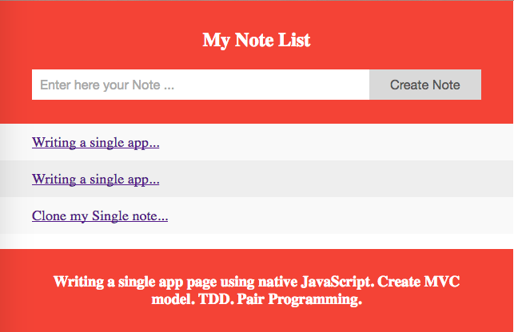

# NoteList Single Page App

## Learning objectives

### Concepts

- Frontend, [single page](https://msdn.microsoft.com/en-gb/magazine/dn463786.aspx) web apps.

- Events and event handlers.

- Manipulating the [Document Object Model (DOM)](https://developer.mozilla.org/en-US/docs/Web/API/Document_Object_Model/Introduction).

- Ajax.

- Frontend templating.

- Frontend routing.

### Tasks

- Writing a single app page using native JavaScript.

- Create MVC model.

- TDD.

- Pair Programming.

### Use app

- Clone my Single note repo ``` https://github.com/ManuCiao/Note-App ```.

- To install the dependencies ```npm install```.

- To run the server ```npm start```.

- Go to ``` http://localhost:8080 ``` in your web browser.

### Here is a preview of the NoteList



